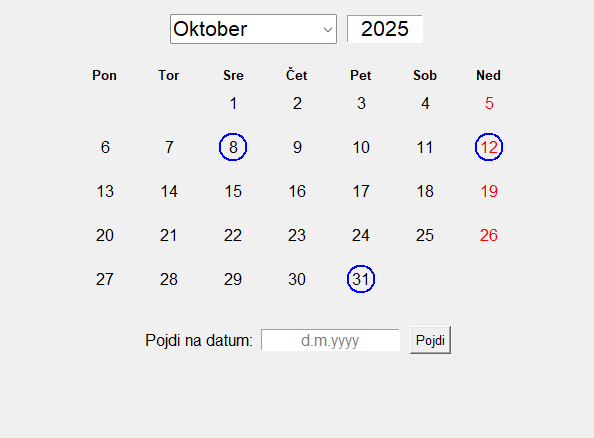

# Implementacija preprostega koledarja

 <!-- Add a screenshot of your calendar application -->

Preprost grafični koledar implementiran v Python-u z uporabo Tkinter knjižnice. Aplikacija omogoča pregledovanje koledarja po mesecih in letih ter označevanje praznikov.

## Funkcionalnosti

- **Grafični prikaz koledarja** - Prikazovanje mesečnega koledarja
- **Navigacija po mesecih** - Izbira meseca iz padajočega menija
- **Navigacija po letih** - Vnos leta s tipkovnico
- **Označevanje praznikov** - Prazniki so označeni z modro barvo
- **Označevanje nedelj** - Nedelje so označeni z rdečo barvo

## Struktura projekta

```
koledar-oddaja/
├── koledar.py          # Glavna aplikacija
├── datumi.txt          # Datoteka s prazniki
├── koledar.spec        # PyInstaller specifikacija
├── README.md           # Ta datoteka
├── build/              # PyInstaller vmesni build direktorij
└── dist/               # PyInstaller končni distribucijski direktorij
    ├── datumi.txt      # Datoteka s prazniki
    └── koledar.exe     # Izvršljiva datoteka (Windows)
```

### Opis datotek

- [`koledar.py`](koledar.py) - Glavna aplikacija z razredom `Koledar` in pomožnimi funkcijami
- [`datumi.txt`](datumi.txt) - Datoteka s prazniki v formatu `dan.mesec,x` (če je x = 'n', se praznik ne ponavlja, sicer se)
- [`koledar.spec`](koledar.spec) - Konfiguracija za PyInstaller za ustvarjanje izvršljive datoteke
- **`build/`** - PyInstaller vmesni direktorij z analizo in gradbenimi datotekami
  - Vsebuje .toc datoteke, .pyz arhive, warns in xref HTML poročila
  - Se lahko varno briše, ponovno se ustvari ob naslednjem build-u
- **`dist/`** - PyInstaller končni distribucijski direktorij
  - Vsebuje pripravljeno izvršljivo datoteko z vsemi potrebnimi odvisnostmi

### Ključne komponente v [`koledar.py`](koledar.py)

- **`mesecnaStruktura`** - Slovar z informacijami o dolžini mesecev
- **`prestopno(leto)`** - Funkcija za preverjanje prestopnih let
- **`zeller(q, m, year)`** - Zellerjev algoritem za določanje dneva v tednu
- **`prazniki(file)`** - Funkcija za branje praznikov iz datoteke
- **`Koledar`** - Glavni razred z GUI logiko

## Kako zagnati program

### Potrebne knjižnice

Program potrebuje naslednje Python knjižnice:
- `tkinter` (vključeno v standardni Python)
- `datetime` (vključeno v standardni Python) 
- `math` (vključeno v standardni Python)

### Zagon iz izvorne kode

```bash
# Kloniraj ali prenesi projekt
git clone <repository-url>
cd koledar-oddaja

# Zaženi aplikacijo
python koledar.py
```

### Zagon izvršljive datoteke

```bash
# Windows - zagon iz dist/ direktorija (priporočeno)
./dist/koledar.exe
```

## Format datoteke s prazniki

Datoteka [`datumi.txt`](datumi.txt) vsebuje praznike v sledečem formatu:

```
17.7,p     # Moj rojstni dan, oznaka p pomeni, da se ponavlja
8.10,n     # Dan roka oddaje projekta, oznaka n pomeni, da se ne ponavlja
31.10      # Dan reformacije, ker ni oznake se privzame, da se ponavlja
```

- `dan.mesec,x` kjer je `x`:
  - `p` ali brez vrednosti  = ponavljajoč praznik, ki se ponovi vsako leto
  - katerakoli druga vrednost = praznik se prikaže samo letos

## Funkcionalnosti aplikacije

### Navigacija
- **Mesec**: Uporabi padajoči meni za izbiro meseca
- **Leto**: Klikni na leto in vtipkaj novo vrednost
- **Datum**: Vnesi datum v formatu `d.m.yyyy` za hiter skok na določen datum

### Vizualne označbe
- **Modra barva**: Prazniki
- **Rdeča barva**: Običajni dnevi

### Ostalo
- Aplikacija se samodejno odpre na trenutnem mesecu in letu
- Podpira vsa leta v obsegu med 1 in 9999
- Pravilno obravnava prestopna leta
